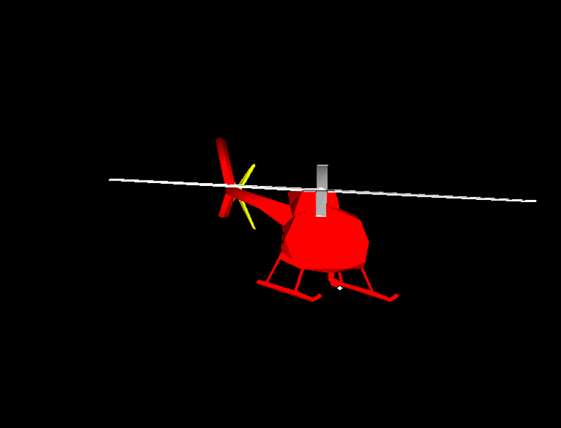
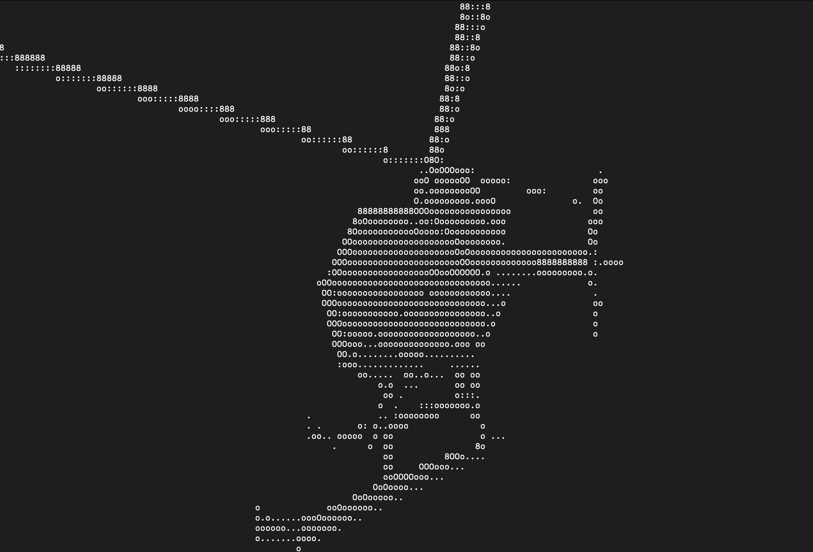

# SPIN 2026 Artifact: GPU Pipeline Formal Model





## Overview

This artifact accompanies the paper **"Formal Modeling and Verification of Various GPU Pipeline Architectures in SPIN"** submitted to SPIN 2026. The artifact demonstrates part of a formal model of a GPU graphics pipeline implemented in Promela, featuring an animated 3D helicopter rendered through console pseudographics.

## Artifact Contents

- `gpu_no_pipeline.pml` - Promela model for 3D rendering of a helipocter model.
It includes `gpu_verticles.pml` - Generated 3d-model verticles definition, `gpu_triangles.pml` - 3d-model triangles setup, `gpu_trigo.pml` - Pre-calculated cine/cosine in fixed-point integers. 
- `run_helicopter_demo.sh` - Main demonstration script.
- `Dockerfile` - Docker container definition.
- `license.txt` - License file.
- `README.md` - This file.
- `heli_orig.png` -  Original rendering result; `heli_spin.png` - SPIN rendering result.

## Quick Start (Docker)

```bash
# Build the Docker image
docker build -t spin2026-gpu-artifact .

# Run the demo
docker run -it --rm spin2026-gpu-artifact

