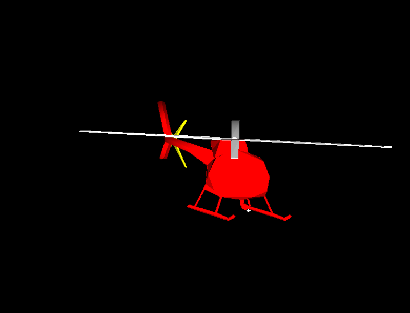
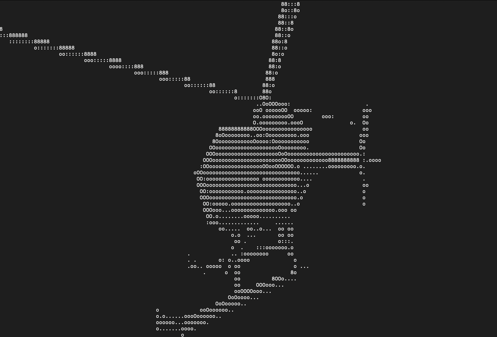
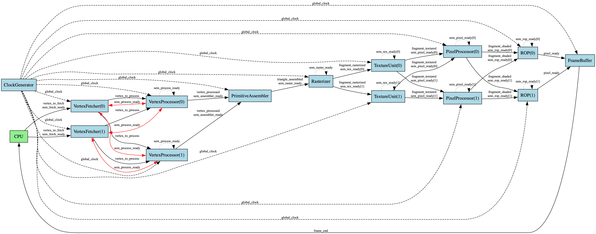

# Fixed GPU Pipeline Formal Model Artifact




New: Youtube talk (in Russian, + subs): 

[](https://youtu.be/d-q_2ObowJ0)


Terminal/ssh should have minimum 200x60 characters for proper visualization! 

## Overview

This artifact accompanies the paper **"Formal Modeling and Verification of Various GPU Pipeline Architectures in SPIN"** submitted to SPIN 2026. The artifact demonstrates part of a formal model of a GPU graphics pipeline implemented in Promela, featuring an animated 3D helicopter rendered through console pseudographics.

## Artifact Contents

- `gpu_no_pipeline.pml` - Promela model for 3D rendering of a helipocter model.
It includes `gpu_verticles.pml` - Generated 3d-model verticles definition, `gpu_triangles.pml` - 3d-model triangles setup, `gpu_trigo.pml` - Pre-calculated cine/cosine in fixed-point integers. 
- `run_helicopter_demo.sh` - Main demonstration script.
- `Dockerfile` - Docker container definition.
- `license.txt` - License file.
- `README.md` - This file.
- `heli_orig.png` -  Original rendering result; `heli_spin.png` - SPIN rendering result.

## Add-on: Pipeline demo (in progress)

GPU pipeline modeled like this (supported various GPU configs for VERTEX_SHADERS, PIXEL_SHADERS, TMUS, ROPS but not tested): 



- `gpu_pipeline_frame.pml` - Current Promela model of pipelined rendering (for now supports only one frame output). I also had to generate the `gpu_adjacency.pml` file to go from vertex space to triangle space (a flat array of which triangles used in which vertices).
- <a href='sample.out'>See sample output, the interprocess communication and the helicopter picture at the end:)</a>


## Quick Start (Docker)

```bash
# Build the Docker image
docker build -t spin2026-gpu-artifact .

# Run the demo
docker run -it --rm spin2026-gpu-artifact

